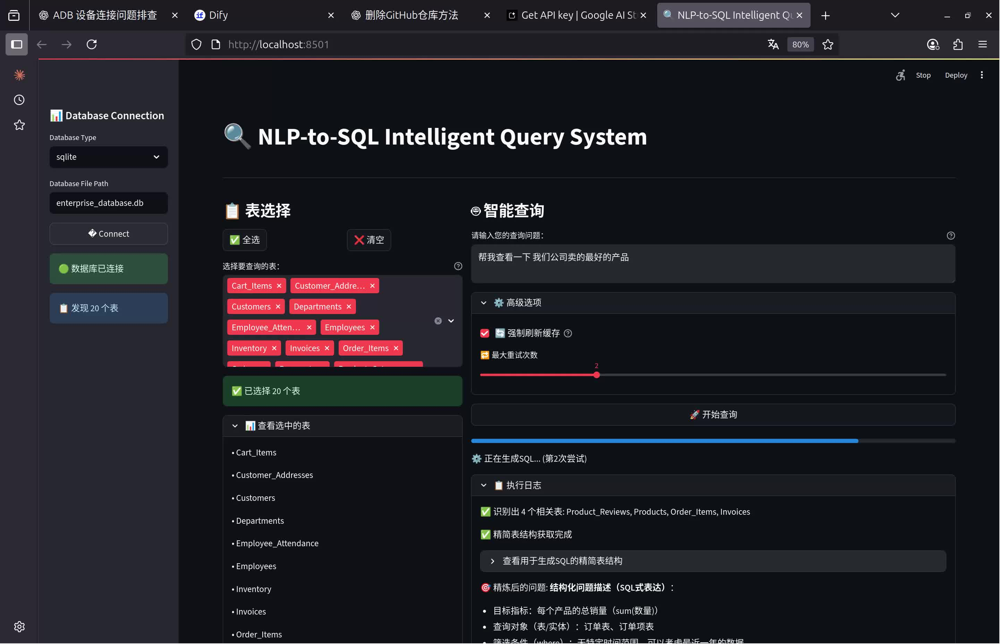

# NLP-to-SQL Intelligent Query System

This project is an intelligent query system that translates natural language questions into SQL queries, executes them, and returns the results. It now uses the Gemini API for its natural language processing capabilities.

## Requirements
- Python 3.8+
- Streamlit

## Installation

1. **Clone the repository and navigate to the project directory:**
   ```bash
   git clone <repository-url>
   cd nlp2SQL4.1
   ```

2. **Create and activate a virtual environment:**
   ```bash
   python -m venv venv
   source venv/bin/activate  # For Linux/Mac
   # venv\Scripts\activate  # For Windows
   ```

3. **Install the required dependencies:**
   ```bash
   pip install -r requirements.txt
   ```

## Configuration

1. **Set up your Gemini API Key:**
   - Open the `config.py` file.
   - Replace `"YOUR_API_KEY_HERE"` with your actual Gemini API key.
   - Alternatively, you can set it as an environment variable named `GEMINI_API_KEY`.

2. **Configure your database:**
   - The project is pre-configured to use a SQLite database (`enterprise_database.db`).
   - If you want to use a different database, update the `DATABASE_CONFIG` in `config.py`.

## How to Run

1. **Ensure all dependencies are installed and the configuration is correct.**

2. **Run the Streamlit application:**
   ```bash
   streamlit run app.py
   ```

3. **Open the provided URL in your web browser (usually `http://localhost:8501`).**

## Project Structure

- `app.py`: The main entry point for the Streamlit web application.
- `config.py`: Contains all configuration variables, including the API key and database settings.
- `service/`: Core modules for SQL generation, execution, and visualization.
- `data/`: Contains the database file and configuration.
- `requirements.txt`: A list of all Python dependencies.
